# 사용자 플로우 (User Flows)

> HomeNRich 주요 시나리오별 사용자 여정 다이어그램

## 문서 정보
- **버전**: 1.0.0
- **작성일**: 2026-02-12
- **다이어그램 도구**: Mermaid
- **업데이트 주기**: 기능 추가 시

---

## 1. 전체 시스템 아키텍처 개요

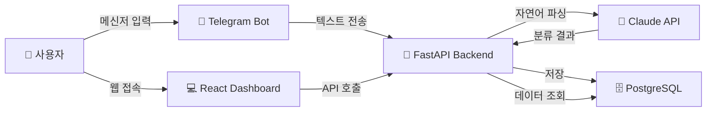
```mermaid
graph LR
    A[👤 사용자] -->|메신저 입력| B[📱 Telegram Bot]
    B -->|텍스트 전송| C[🔧 FastAPI Backend]
    C -->|자연어 파싱| D[🤖 Claude API]
    D -->|분류 결과| C
    C -->|저장| E[🗄️ PostgreSQL]
    A -->|웹 접속| F[💻 React Dashboard]
    F -->|API 호출| C
    C -->|데이터 조회| E
```

---

## 2. Flow 1: 메신저 지출 입력 (기본 플로우)

### 2.1 성공 시나리오 (Happy Path)

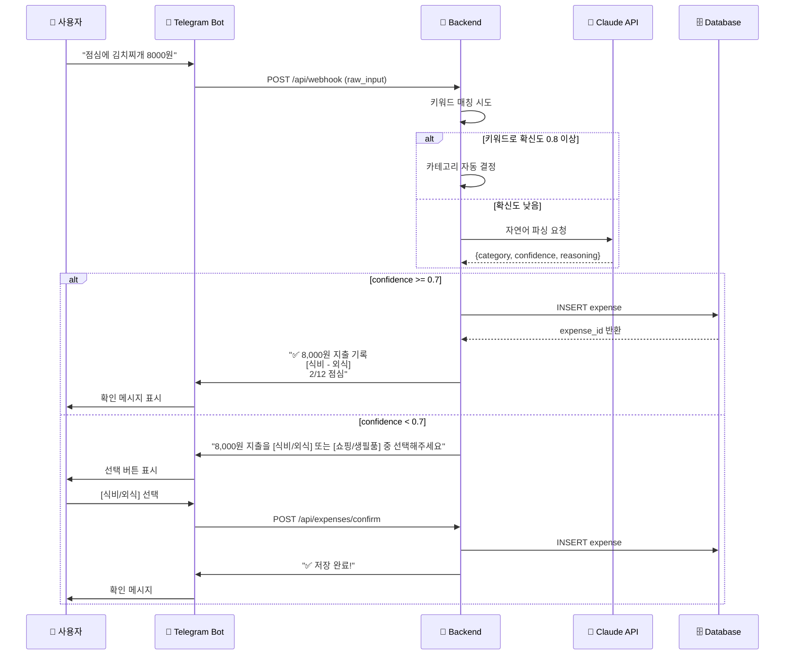
```mermaid
sequenceDiagram
    participant U as 👤 사용자
    participant T as 📱 Telegram Bot
    participant B as 🔧 Backend
    participant C as 🤖 Claude API
    participant D as 🗄️ Database

    U->>T: "점심에 김치찌개 8000원"
    T->>B: POST /api/webhook (raw_input)

    B->>B: 키워드 매칭 시도
    alt 키워드로 확신도 0.8 이상
        B->>B: 카테고리 자동 결정
    else 확신도 낮음
        B->>C: 자연어 파싱 요청
        C-->>B: {category, confidence, reasoning}
    end

    alt confidence >= 0.7
        B->>D: INSERT expense
        D-->>B: expense_id 반환
        B->>T: "✅ 8,000원 지출 기록<br/>[식비 - 외식]<br/>2/12 점심"
        T->>U: 확인 메시지 표시
    else confidence < 0.7
        B->>T: "8,000원 지출을 [식비/외식] 또는 [쇼핑/생필품] 중 선택해주세요"
        T->>U: 선택 버튼 표시
        U->>T: [식비/외식] 선택
        T->>B: POST /api/expenses/confirm
        B->>D: INSERT expense
        B->>T: "✅ 저장 완료!"
        T->>U: 확인 메시지
    end
```

### 2.2 Mermaid 플로우차트 (사용자 관점)

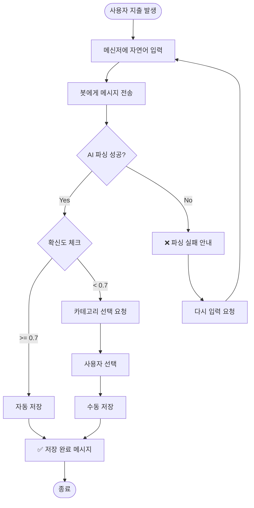
```mermaid
flowchart TD
    Start([사용자 지출 발생]) --> Input[메신저에 자연어 입력]
    Input --> Send[봇에게 메시지 전송]
    Send --> Parse{AI 파싱 성공?}

    Parse -->|Yes| Confidence{확신도 체크}
    Parse -->|No| Error[❌ 파싱 실패 안내]
    Error --> Retry[다시 입력 요청]
    Retry --> Input

    Confidence -->|>= 0.7| AutoSave[자동 저장]
    Confidence -->|< 0.7| AskUser[카테고리 선택 요청]

    AutoSave --> Success[✅ 저장 완료 메시지]
    AskUser --> UserSelect[사용자 선택]
    UserSelect --> ManualSave[수동 저장]
    ManualSave --> Success

    Success --> End([종료])
```

---

## 3. Flow 2: 웹 대시보드 조회

### 3.1 초기 접속 및 목록 조회

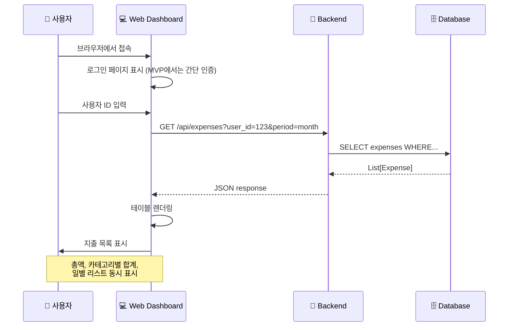
```mermaid
sequenceDiagram
    participant U as 👤 사용자
    participant W as 💻 Web Dashboard
    participant B as 🔧 Backend
    participant D as 🗄️ Database

    U->>W: 브라우저에서 접속
    W->>W: 로그인 페이지 표시 (MVP에서는 간단 인증)
    U->>W: 사용자 ID 입력
    W->>B: GET /api/expenses?user_id=123&period=month
    B->>D: SELECT expenses WHERE...
    D-->>B: List[Expense]
    B-->>W: JSON response
    W->>W: 테이블 렌더링
    W->>U: 지출 목록 표시

    Note over W,U: 총액, 카테고리별 합계,<br/>일별 리스트 동시 표시
```

### 3.2 웹 조회 플로우차트

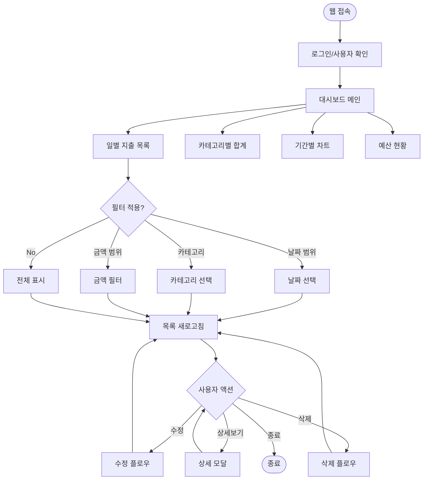
```mermaid
flowchart TD
    Start([웹 접속]) --> Login[로그인/사용자 확인]
    Login --> Dashboard[대시보드 메인]

    Dashboard --> View1[일별 지출 목록]
    Dashboard --> View2[카테고리별 합계]
    Dashboard --> View3[기간별 차트]
    Dashboard --> View4[예산 현황]

    View1 --> Filter{필터 적용?}
    Filter -->|날짜 범위| DateFilter[날짜 선택]
    Filter -->|카테고리| CatFilter[카테고리 선택]
    Filter -->|금액 범위| AmountFilter[금액 필터]
    Filter -->|No| ShowAll[전체 표시]

    DateFilter --> Refresh[목록 새로고침]
    CatFilter --> Refresh
    AmountFilter --> Refresh
    ShowAll --> Refresh

    Refresh --> Action{사용자 액션}
    Action -->|수정| EditFlow[수정 플로우]
    Action -->|삭제| DeleteFlow[삭제 플로우]
    Action -->|상세보기| DetailFlow[상세 모달]
    Action -->|종료| End([종료])

    EditFlow --> Refresh
    DeleteFlow --> Refresh
    DetailFlow --> Action
```

---

## 4. Flow 3: 지출 수정 (Web)

### 4.1 수정 시퀀스

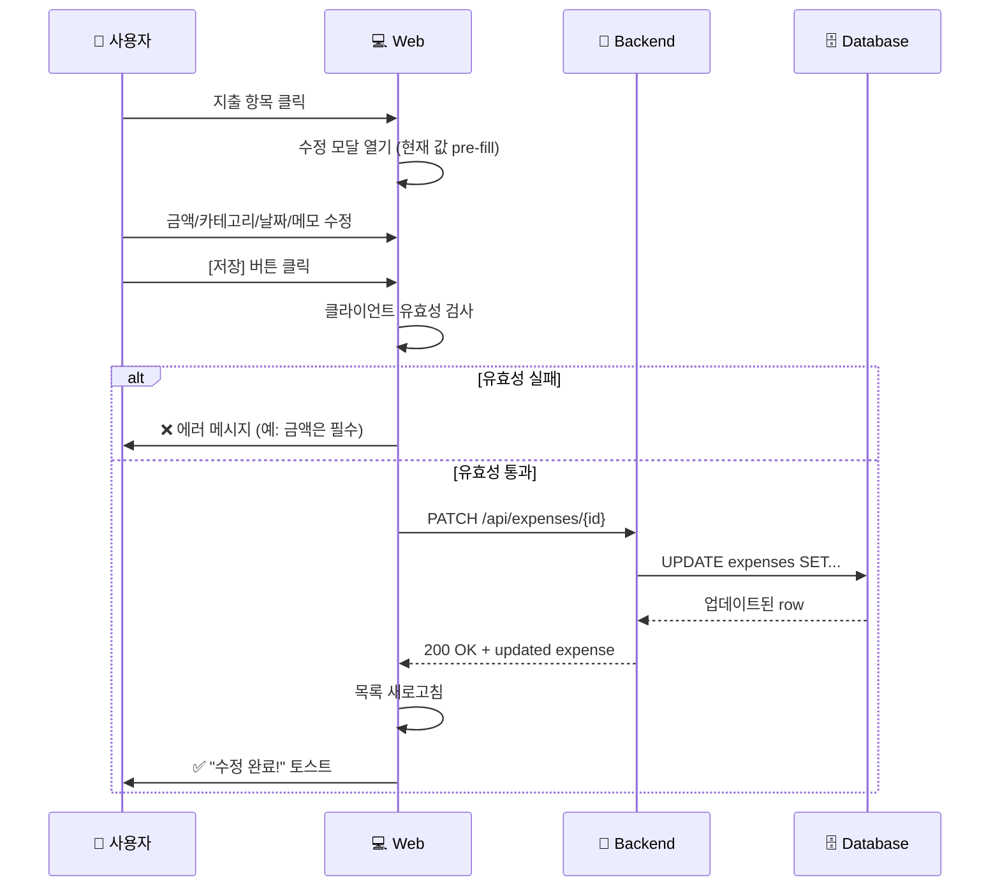
```mermaid
sequenceDiagram
    participant U as 👤 사용자
    participant W as 💻 Web
    participant B as 🔧 Backend
    participant D as 🗄️ Database

    U->>W: 지출 항목 클릭
    W->>W: 수정 모달 열기 (현재 값 pre-fill)
    U->>W: 금액/카테고리/날짜/메모 수정
    U->>W: [저장] 버튼 클릭

    W->>W: 클라이언트 유효성 검사
    alt 유효성 실패
        W->>U: ❌ 에러 메시지 (예: 금액은 필수)
    else 유효성 통과
        W->>B: PATCH /api/expenses/{id}
        B->>D: UPDATE expenses SET...
        D-->>B: 업데이트된 row
        B-->>W: 200 OK + updated expense
        W->>W: 목록 새로고침
        W->>U: ✅ "수정 완료!" 토스트
    end
```

### 4.2 수정 플로우차트

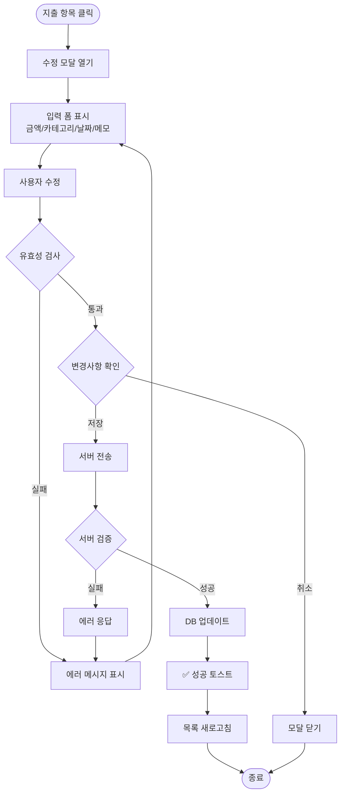
```mermaid
flowchart TD
    Start([지출 항목 클릭]) --> Modal[수정 모달 열기]
    Modal --> Form[입력 폼 표시<br/>금액/카테고리/날짜/메모]

    Form --> Edit[사용자 수정]
    Edit --> Validate{유효성 검사}

    Validate -->|실패| Error[에러 메시지 표시]
    Error --> Form

    Validate -->|통과| Confirm{변경사항 확인}
    Confirm -->|취소| Close[모달 닫기]
    Confirm -->|저장| Submit[서버 전송]

    Submit --> ServerValidate{서버 검증}
    ServerValidate -->|실패| ServerError[에러 응답]
    ServerError --> Error

    ServerValidate -->|성공| Save[DB 업데이트]
    Save --> Success[✅ 성공 토스트]
    Success --> Refresh[목록 새로고침]
    Refresh --> End([종료])
    Close --> End
```

---

## 5. Flow 4: 지출 삭제

### 5.1 웹에서 삭제

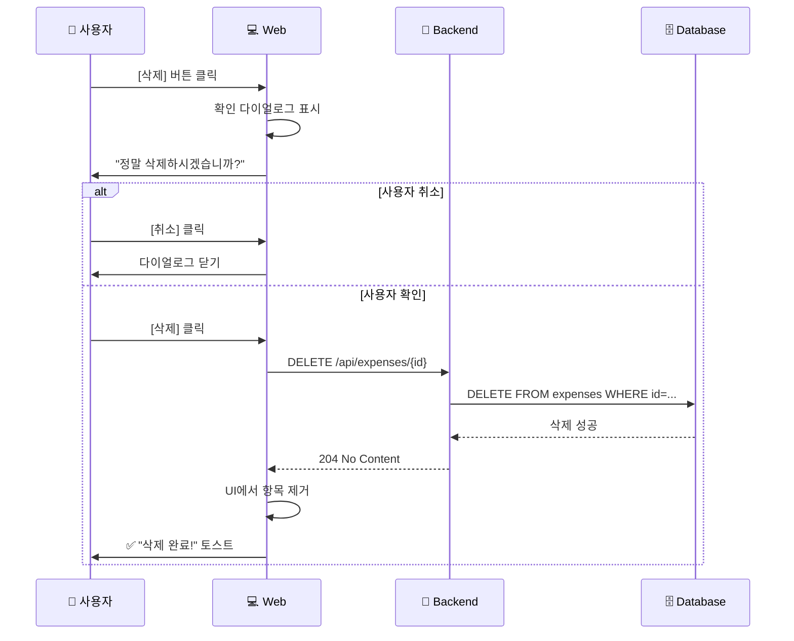
```mermaid
sequenceDiagram
    participant U as 👤 사용자
    participant W as 💻 Web
    participant B as 🔧 Backend
    participant D as 🗄️ Database

    U->>W: [삭제] 버튼 클릭
    W->>W: 확인 다이얼로그 표시
    W->>U: "정말 삭제하시겠습니까?"

    alt 사용자 취소
        U->>W: [취소] 클릭
        W->>U: 다이얼로그 닫기
    else 사용자 확인
        U->>W: [삭제] 클릭
        W->>B: DELETE /api/expenses/{id}
        B->>D: DELETE FROM expenses WHERE id=...
        D-->>B: 삭제 성공
        B-->>W: 204 No Content
        W->>W: UI에서 항목 제거
        W->>U: ✅ "삭제 완료!" 토스트
    end
```

### 5.2 메신저에서 삭제

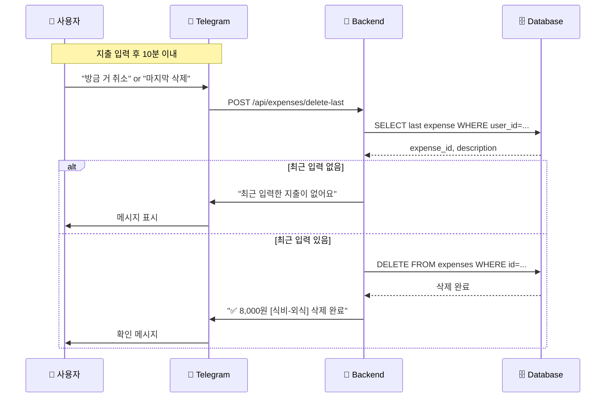
```mermaid
sequenceDiagram
    participant U as 👤 사용자
    participant T as 📱 Telegram
    participant B as 🔧 Backend
    participant D as 🗄️ Database

    Note over U,T: 지출 입력 후 10분 이내

    U->>T: "방금 거 취소" or "마지막 삭제"
    T->>B: POST /api/expenses/delete-last
    B->>D: SELECT last expense WHERE user_id=...
    D-->>B: expense_id, description

    alt 최근 입력 없음
        B->>T: "최근 입력한 지출이 없어요"
        T->>U: 메시지 표시
    else 최근 입력 있음
        B->>D: DELETE FROM expenses WHERE id=...
        D-->>B: 삭제 완료
        B->>T: "✅ 8,000원 [식비-외식] 삭제 완료"
        T->>U: 확인 메시지
    end
```

---

## 6. Flow 5: 예산 설정 및 알림

### 6.1 예산 설정 (Web)

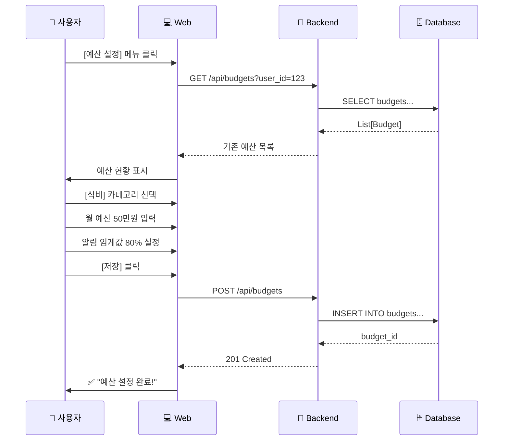
```mermaid
sequenceDiagram
    participant U as 👤 사용자
    participant W as 💻 Web
    participant B as 🔧 Backend
    participant D as 🗄️ Database

    U->>W: [예산 설정] 메뉴 클릭
    W->>B: GET /api/budgets?user_id=123
    B->>D: SELECT budgets...
    D-->>B: List[Budget]
    B-->>W: 기존 예산 목록
    W->>U: 예산 현황 표시

    U->>W: [식비] 카테고리 선택
    U->>W: 월 예산 50만원 입력
    U->>W: 알림 임계값 80% 설정
    U->>W: [저장] 클릭

    W->>B: POST /api/budgets
    B->>D: INSERT INTO budgets...
    D-->>B: budget_id
    B-->>W: 201 Created
    W->>U: ✅ "예산 설정 완료!"
```

### 6.2 예산 초과 알림 트리거

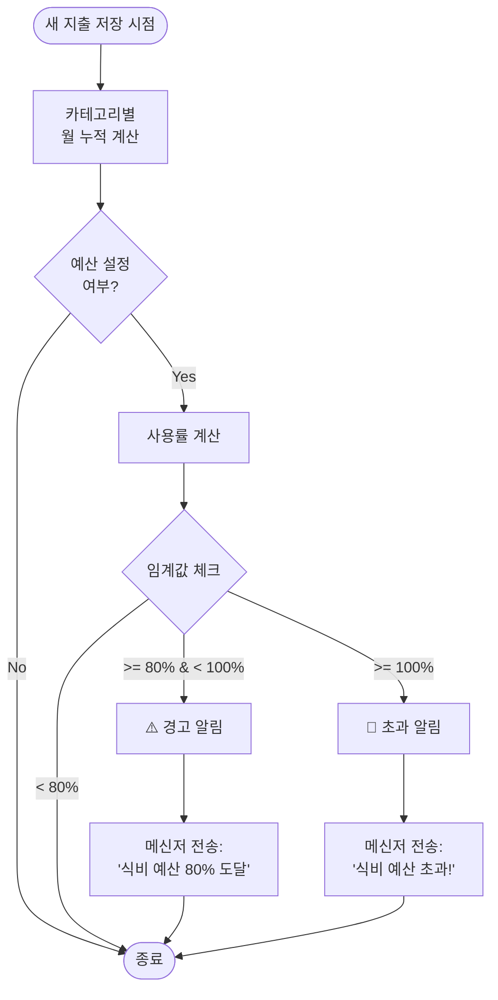
```mermaid
flowchart TD
    Start([새 지출 저장 시점]) --> CalcTotal[카테고리별<br/>월 누적 계산]
    CalcTotal --> CheckBudget{예산 설정<br/>여부?}

    CheckBudget -->|No| End([종료])
    CheckBudget -->|Yes| CalcRate[사용률 계산]

    CalcRate --> CheckThreshold{임계값 체크}
    CheckThreshold -->|< 80%| End
    CheckThreshold -->|>= 80% & < 100%| Warning[⚠️ 경고 알림]
    CheckThreshold -->|>= 100%| Critical[🚨 초과 알림]

    Warning --> SendMsg1[메신저 전송:<br/>'식비 예산 80% 도달']
    Critical --> SendMsg2[메신저 전송:<br/>'식비 예산 초과!']

    SendMsg1 --> End
    SendMsg2 --> End
```

### 6.3 예산 알림 시퀀스

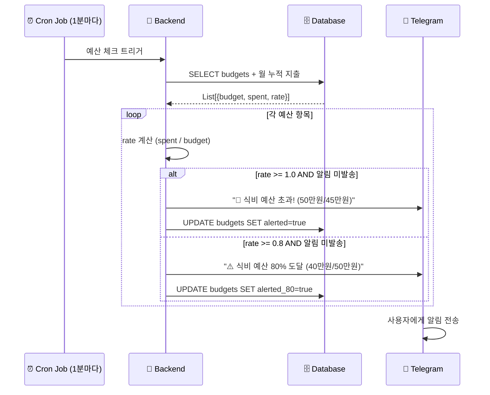
```mermaid
sequenceDiagram
    participant C as ⏰ Cron Job (1분마다)
    participant B as 🔧 Backend
    participant D as 🗄️ Database
    participant T as 📱 Telegram

    C->>B: 예산 체크 트리거
    B->>D: SELECT budgets + 월 누적 지출
    D-->>B: List[{budget, spent, rate}]

    loop 각 예산 항목
        B->>B: rate 계산 (spent / budget)
        alt rate >= 1.0 AND 알림 미발송
            B->>T: "🚨 식비 예산 초과! (50만원/45만원)"
            B->>D: UPDATE budgets SET alerted=true
        else rate >= 0.8 AND 알림 미발송
            B->>T: "⚠️ 식비 예산 80% 도달 (40만원/50만원)"
            B->>D: UPDATE budgets SET alerted_80=true
        end
    end

    T->>T: 사용자에게 알림 전송
```

---

## 7. Flow 6: 여러 지출 한 번에 입력

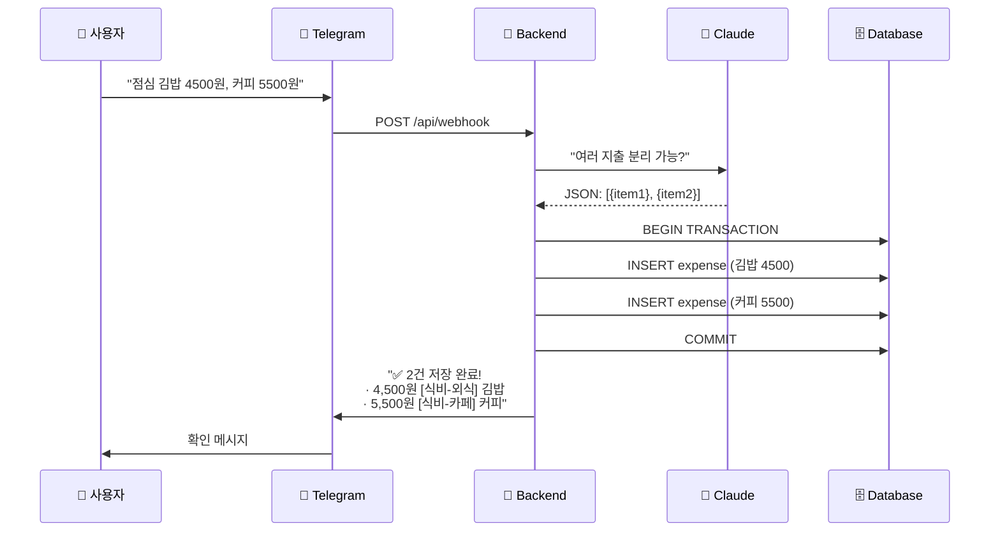
```mermaid
sequenceDiagram
    participant U as 👤 사용자
    participant T as 📱 Telegram
    participant B as 🔧 Backend
    participant C as 🤖 Claude
    participant D as 🗄️ Database

    U->>T: "점심 김밥 4500원, 커피 5500원"
    T->>B: POST /api/webhook
    B->>C: "여러 지출 분리 가능?"
    C-->>B: JSON: [{item1}, {item2}]

    B->>D: BEGIN TRANSACTION
    B->>D: INSERT expense (김밥 4500)
    B->>D: INSERT expense (커피 5500)
    B->>D: COMMIT

    B->>T: "✅ 2건 저장 완료!<br/>· 4,500원 [식비-외식] 김밥<br/>· 5,500원 [식비-카페] 커피"
    T->>U: 확인 메시지
```

---

## 8. Flow 7: 영수증 사진 인식 (P2)

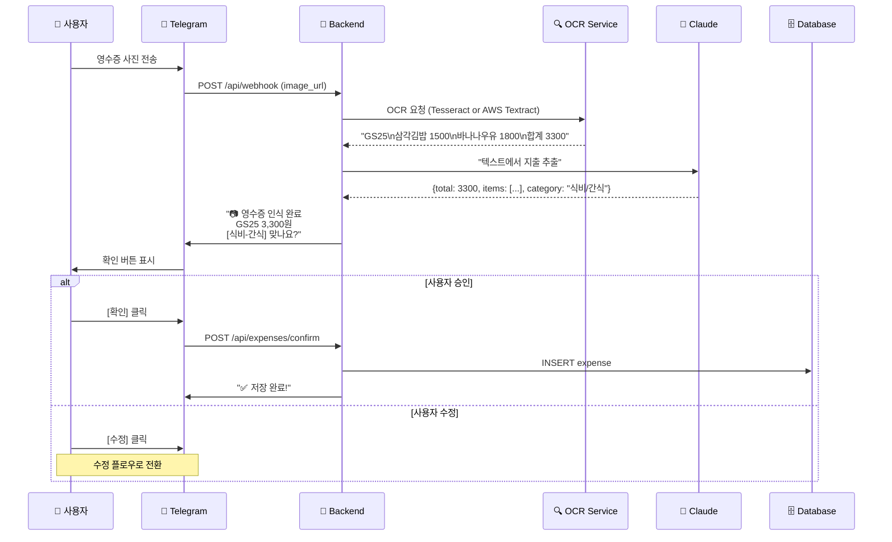
```mermaid
sequenceDiagram
    participant U as 👤 사용자
    participant T as 📱 Telegram
    participant B as 🔧 Backend
    participant O as 🔍 OCR Service
    participant C as 🤖 Claude
    participant D as 🗄️ Database

    U->>T: 영수증 사진 전송
    T->>B: POST /api/webhook (image_url)
    B->>O: OCR 요청 (Tesseract or AWS Textract)
    O-->>B: "GS25\n삼각김밥 1500\n바나나우유 1800\n합계 3300"

    B->>C: "텍스트에서 지출 추출"
    C-->>B: {total: 3300, items: [...], category: "식비/간식"}

    B->>T: "📷 영수증 인식 완료<br/>GS25 3,300원<br/>[식비-간식] 맞나요?"
    T->>U: 확인 버튼 표시

    alt 사용자 승인
        U->>T: [확인] 클릭
        T->>B: POST /api/expenses/confirm
        B->>D: INSERT expense
        B->>T: "✅ 저장 완료!"
    else 사용자 수정
        U->>T: [수정] 클릭
        Note over U,T: 수정 플로우로 전환
    end
```

---

## 9. Flow 8: 주간/월간 리포트 생성

### 9.1 리포트 생성 크론잡

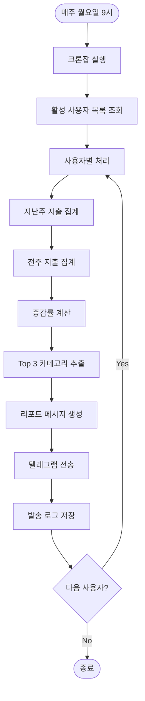
```mermaid
flowchart TD
    Start([매주 월요일 9시]) --> Trigger[크론잡 실행]
    Trigger --> GetUsers[활성 사용자 목록 조회]

    GetUsers --> Loop[사용자별 처리]
    Loop --> CalcWeek[지난주 지출 집계]
    CalcWeek --> CalcPrev[전주 지출 집계]

    CalcPrev --> Compare[증감률 계산]
    Compare --> TopCat[Top 3 카테고리 추출]
    TopCat --> GenMsg[리포트 메시지 생성]

    GenMsg --> SendTelegram[텔레그램 전송]
    SendTelegram --> SaveLog[발송 로그 저장]

    SaveLog --> CheckNext{다음 사용자?}
    CheckNext -->|Yes| Loop
    CheckNext -->|No| End([종료])
```

### 9.2 리포트 전송 시퀀스

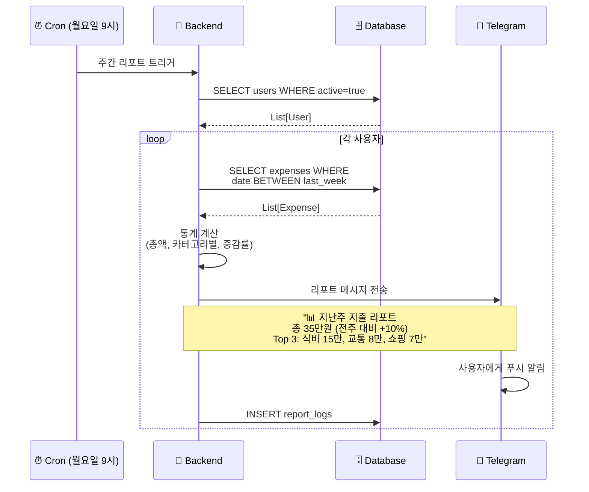
```mermaid
sequenceDiagram
    participant C as ⏰ Cron (월요일 9시)
    participant B as 🔧 Backend
    participant D as 🗄️ Database
    participant T as 📱 Telegram

    C->>B: 주간 리포트 트리거
    B->>D: SELECT users WHERE active=true
    D-->>B: List[User]

    loop 각 사용자
        B->>D: SELECT expenses WHERE<br/>date BETWEEN last_week
        D-->>B: List[Expense]

        B->>B: 통계 계산<br/>(총액, 카테고리별, 증감률)

        B->>T: 리포트 메시지 전송
        Note over B,T: "📊 지난주 지출 리포트<br/>총 35만원 (전주 대비 +10%)<br/>Top 3: 식비 15만, 교통 8만, 쇼핑 7만"

        T->>T: 사용자에게 푸시 알림

        B->>D: INSERT report_logs
    end
```

---

## 10. Flow 9: 에러 처리 플로우

### 10.1 파싱 실패

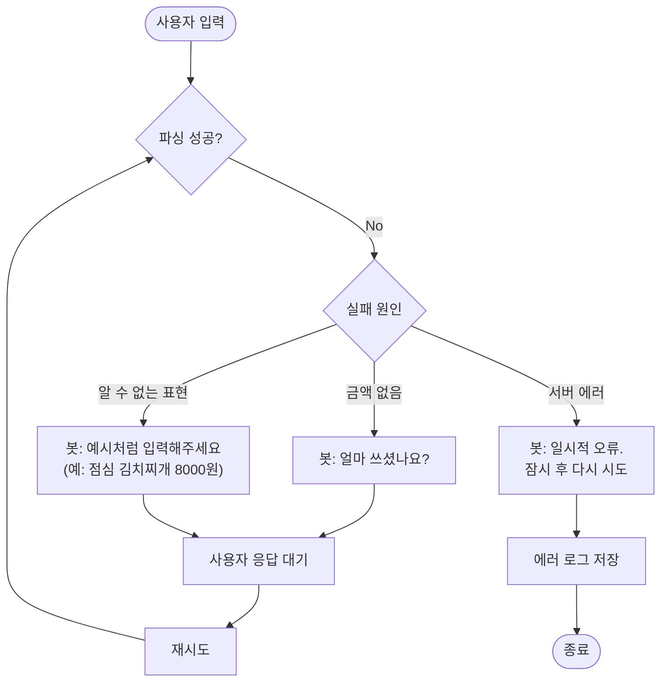
```mermaid
flowchart TD
    Start([사용자 입력]) --> Parse{파싱 성공?}

    Parse -->|No| CheckReason{실패 원인}

    CheckReason -->|금액 없음| AskAmount["봇: 얼마 쓰셨나요?"]
    CheckReason -->|알 수 없는 표현| AskFormat["봇: 예시처럼 입력해주세요<br/>(예: 점심 김치찌개 8000원)"]
    CheckReason -->|서버 에러| SystemError["봇: 일시적 오류.<br/>잠시 후 다시 시도"]

    AskAmount --> WaitUser[사용자 응답 대기]
    AskFormat --> WaitUser
    SystemError --> Log[에러 로그 저장]

    WaitUser --> Retry[재시도]
    Retry --> Parse

    Log --> End([종료])
```

### 10.2 네트워크 에러

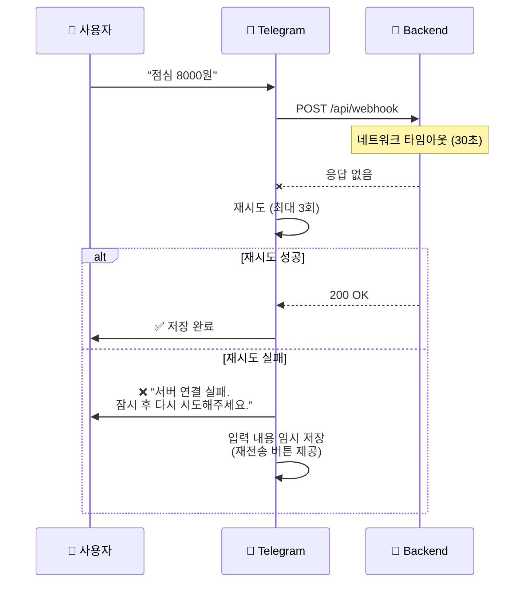
```mermaid
sequenceDiagram
    participant U as 👤 사용자
    participant T as 📱 Telegram
    participant B as 🔧 Backend

    U->>T: "점심 8000원"
    T->>B: POST /api/webhook

    Note over B: 네트워크 타임아웃 (30초)

    B--xT: 응답 없음
    T->>T: 재시도 (최대 3회)

    alt 재시도 성공
        B-->>T: 200 OK
        T->>U: ✅ 저장 완료
    else 재시도 실패
        T->>U: ❌ "서버 연결 실패.<br/>잠시 후 다시 시도해주세요."
        T->>T: 입력 내용 임시 저장<br/>(재전송 버튼 제공)
    end
```

---

## 11. Flow 10: 사용자 온보딩 (첫 사용)

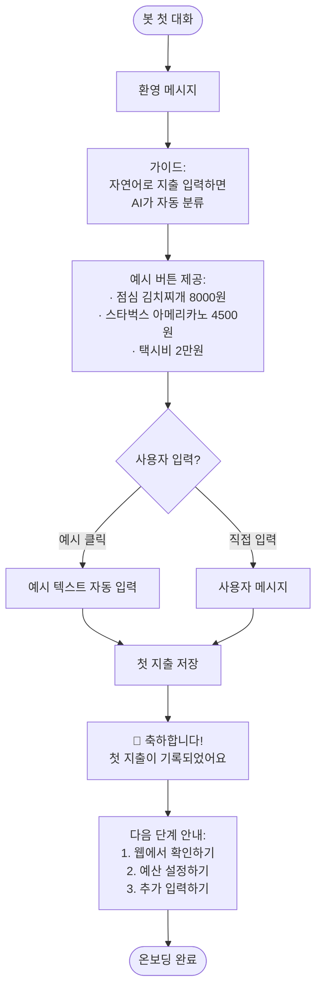
```mermaid
flowchart TD
    Start([봇 첫 대화]) --> Welcome[환영 메시지]
    Welcome --> Explain["가이드:<br/>자연어로 지출 입력하면<br/>AI가 자동 분류"]

    Explain --> Example["예시 버튼 제공:<br/>· 점심 김치찌개 8000원<br/>· 스타벅스 아메리카노 4500원<br/>· 택시비 2만원"]

    Example --> TryNow{사용자 입력?}

    TryNow -->|예시 클릭| AutoFill[예시 텍스트 자동 입력]
    TryNow -->|직접 입력| UserInput[사용자 메시지]

    AutoFill --> FirstSave[첫 지출 저장]
    UserInput --> FirstSave

    FirstSave --> Congrats["🎉 축하합니다!<br/>첫 지출이 기록되었어요"]
    Congrats --> NextStep["다음 단계 안내:<br/>1. 웹에서 확인하기<br/>2. 예산 설정하기<br/>3. 추가 입력하기"]

    NextStep --> End([온보딩 완료])
```

---

## 12. 상태 다이어그램: Expense 생애주기

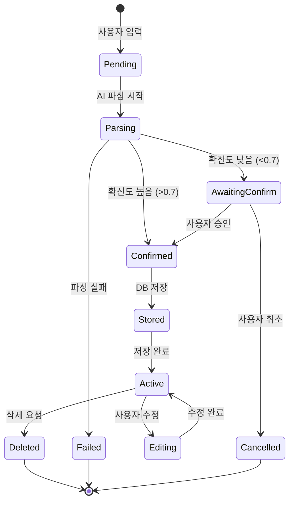
```mermaid
stateDiagram-v2
    [*] --> Pending: 사용자 입력

    Pending --> Parsing: AI 파싱 시작
    Parsing --> Confirmed: 확신도 높음 (>0.7)
    Parsing --> AwaitingConfirm: 확신도 낮음 (<0.7)
    Parsing --> Failed: 파싱 실패

    AwaitingConfirm --> Confirmed: 사용자 승인
    AwaitingConfirm --> Cancelled: 사용자 취소

    Confirmed --> Stored: DB 저장
    Stored --> Active: 저장 완료

    Active --> Editing: 사용자 수정
    Editing --> Active: 수정 완료

    Active --> Deleted: 삭제 요청
    Deleted --> [*]

    Failed --> [*]
    Cancelled --> [*]
```

---

## 13. 컴포넌트 간 상호작용 맵

```mermaid
graph TD
    subgraph "사용자 인터페이스"
        TG[📱 Telegram Bot]
        WEB[💻 Web Dashboard]
    end

    subgraph "백엔드 서비스"
        API[🔧 FastAPI]
        CRON[⏰ Cron Jobs]
    end

    subgraph "외부 서비스"
        CLAUDE[🤖 Claude API]
        OCR[🔍 OCR Service]
    end

    subgraph "데이터 계층"
        DB[(🗄️ PostgreSQL)]
        CACHE[(⚡ Redis)]
    end

    TG -->|Webhook| API
    WEB -->|HTTP REST| API
    API -->|파싱 요청| CLAUDE
    API -->|OCR 요청| OCR
    API -->|저장/조회| DB
    API -->|캐시| CACHE
    CRON -->|정기 작업| API
    CRON -->|알림 전송| TG
```

---

## 14. 예외 시나리오 매트릭스

| 시나리오 | 발생 조건 | 시스템 응답 | 사용자 액션 |
|----------|-----------|-------------|-------------|
| 금액 누락 | "점심 먹었어" | "얼마 쓰셨나요?" | 금액 입력 |
| 날짜 모호 | "지난주에 영화" | "며칠인지 알려주세요" | 날짜 선택 |
| 카테고리 불명확 | "치맥 5만원" | 식비 OR 여가 선택 버튼 | 카테고리 선택 |
| 중복 입력 | 10초 이내 동일 금액 | "방금 입력하셨는데 맞나요?" | 확인/취소 |
| 비정상 금액 | "점심 500만원" | "금액이 맞나요?" | 수정 |
| 서버 다운 | API 응답 없음 | 재시도 3회 후 에러 | 나중에 재시도 |
| Claude API 실패 | Rate limit 초과 | 키워드 기반으로 대체 | 자동 처리 |
| 예산 미설정 | 알림 트리거 시 | 예산 설정 유도 메시지 | 웹에서 설정 |

---

## 15. 성능 고려사항

### 응답 시간 목표

| 플로우 | 목표 시간 | 측정 지점 |
|--------|-----------|-----------|
| 메신저 입력 → 확인 | < 3초 | 사용자 메시지 전송 ~ 봇 응답 |
| 웹 목록 조회 | < 1초 | API 호출 ~ 렌더링 완료 |
| 지출 수정 | < 2초 | 저장 클릭 ~ 성공 토스트 |
| 예산 알림 발송 | < 5분 | 초과 시점 ~ 메시지 수신 |

### 병렬 처리 최적화

- **여러 지출 입력 시**: Claude API 한 번 호출로 배치 처리
- **웹 대시보드**: 목록/차트/통계 API 병렬 요청
- **예산 알림**: 사용자별 비동기 처리 (Celery or asyncio)

---

## 16. 다음 단계 (구현 우선순위)

### Week 1-2 (P0)
- [ ] Flow 1 (메신저 입력) 구현
- [ ] Flow 2 (웹 조회) 구현
- [ ] Flow 9 (에러 처리) 기본 로직

### Week 3 (P1)
- [ ] Flow 3 (지출 수정) 구현
- [ ] Flow 4 (지출 삭제) 구현
- [ ] Flow 5 (예산 설정 및 알림) 구현

### Week 4 (P2)
- [ ] Flow 6 (여러 지출 처리) 구현
- [ ] Flow 8 (주간 리포트) 구현
- [ ] Flow 10 (온보딩) 완성

### Post-MVP
- [ ] Flow 7 (영수증 OCR)
- [ ] 고급 통계 및 인사이트

---

## 참고 자료

- [Mermaid 문법 가이드](https://mermaid.js.org/)
- [Telegram Bot API Webhooks](https://core.telegram.org/bots/api#setwebhook)
- [FastAPI Background Tasks](https://fastapi.tiangolo.com/tutorial/background-tasks/)

---

**변경 이력**
- 2026-02-12: v1.0.0 초안 작성 (10개 주요 플로우 정의)
